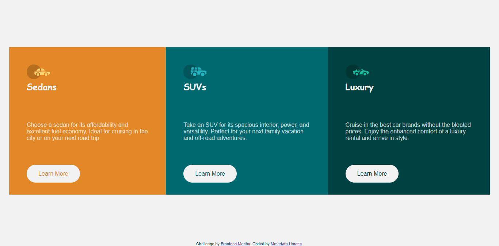

# Frontend Mentor - 3-column preview card component solution

This is a solution to the [3-column preview card component challenge on Frontend Mentor](https://www.frontendmentor.io/challenges/3column-preview-card-component-pH92eAR2-). Frontend Mentor challenges help you improve your coding skills by building realistic projects. 

## Table of contents

- [Frontend Mentor - 3-column preview card component solution](#frontend-mentor---3-column-preview-card-component-solution)
  - [Table of contents](#table-of-contents)
  - [Overview](#overview)
    - [The challenge](#the-challenge)
    - [Screenshot](#screenshot)
    - [Links](#links)
  - [My process](#my-process)
    - [Built with](#built-with)
    - [What I learned](#what-i-learned)
  - [Author](#author)

## Overview

### The challenge

Users should be able to:

- View the optimal layout depending on their device's screen size
- See hover states for interactive elements

### Screenshot

### Links

- [Solution URL](https://github.com/MmedaraU/3-column-preview-card-component)
- [Live Site URL](https://your-live-site-url.com)

## My process

### Built with

- Semantic HTML5 markup
- Sass/SCSS
- Flexbox

### What I learned

It took me a while to implement the text color change with the hover effect on the buttons which turned out to be more of specificity issue. I was happy I got to figure it out.

## Author

- Hashnode - [Mmedara Umana](https://mmedaraumana.hashnode.dev/)
- Frontend Mentor - [@MmedaraU](https://www.frontendmentor.io/profile/MmedaraU)
- Twitter - [@MmedaraUmana](https://twitter.com/MmedaraUmana)
- Github - [MmedaraU](https://github.com/MmedaraU)
